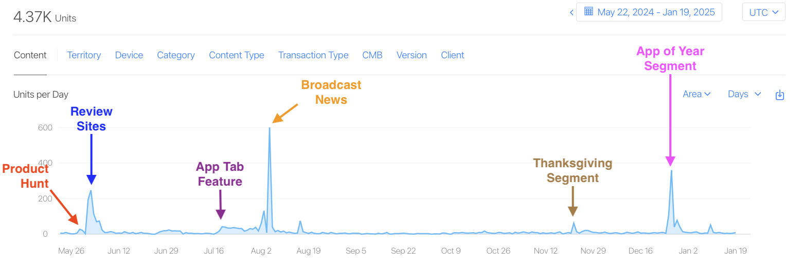
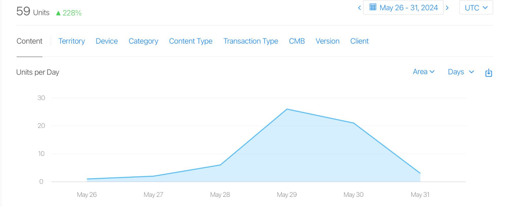
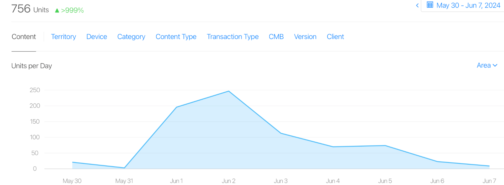
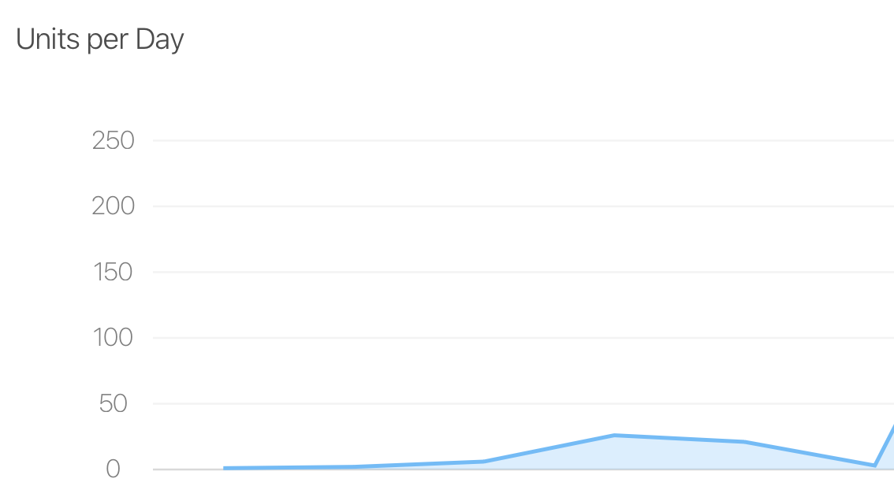
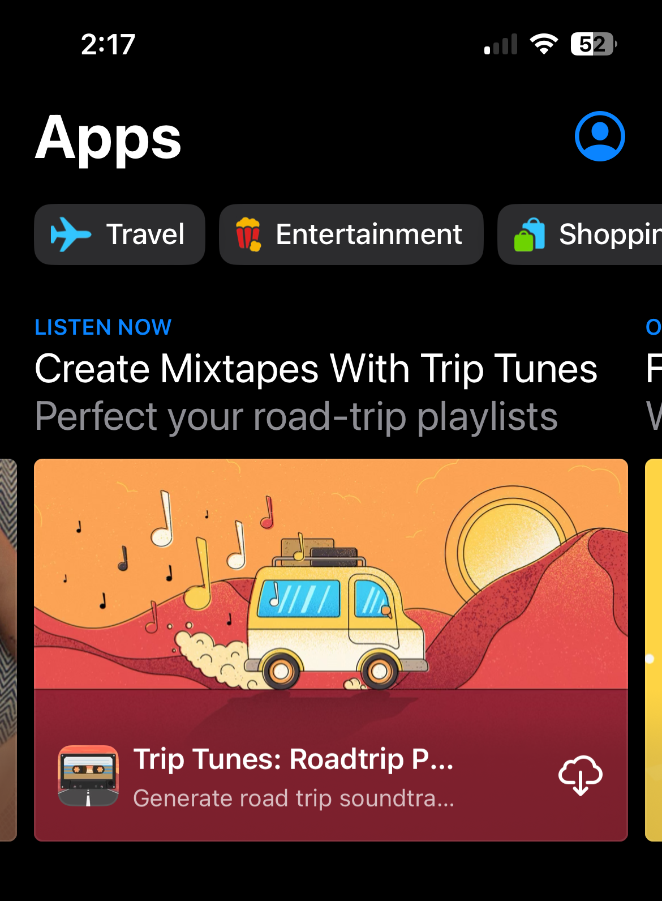
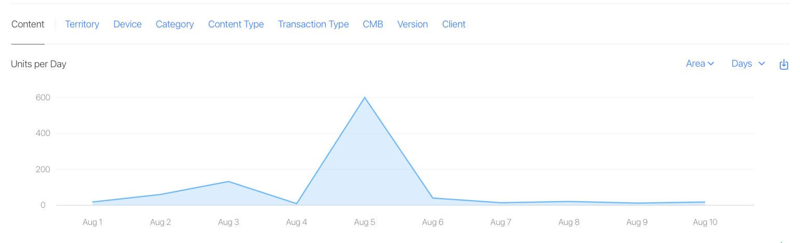

Last year, I released my first indie app in over a decade. It was my first real dive into the business side of the App Store in years, so I treated it as an experiment. That experiment led to some surprises—and a few lessons worth sharing.

A few strategic moves turned into an Apple feature, news segments, and thousands of downloads. What surprised me the most was the limited direct impact of the App Store feature. What really moved the needle were the downstream effects—most notably, the news coverage it helped spark.

<em>Figure 1: You’ll see the biggest spikes came from news broadcasts, with some app review site articles in the next spot. Product Hunt was a very small bump and the main Apps tab Apple feature was not too much bigger.</em>

This post isn’t a guide for building a million-dollar app (or even a hundred-dollar app). Instead, it’s a candid look at how I approached promoting my app with limited time and budget, how it worked out and some lessons learned.

## How I Got Here

Around the end of 2023, I decided it was time to break the cycle of abandoned projects. The smartest thing I did was set realistic expectations and focus on a simpler idea. I had to let go of the notion that my first indie app in years needed to be perfect or overly ambitious. In fact, I decided to go for something as trivial as possible (without being a fart app).

In the early days of LLMs, I asked ChatGPT for road trip playlist recommendations. It did a decent job, but adding songs to Apple Music was painfully slow. That’s when I built a quick prototype to streamline the process. It worked—but it was sluggish and utilitarian.  
I decided to address the slow generation process by making an interesting loading screen. That’s when I settled on a skeuomorphic look and embraced an 80s mixtape vibe. This was the inflection point, and after that I was pretty excited about building something people might actually want to use.

In early 2024, I got to a point where I was pretty proud of what I’d built. I’d cobbled together something that looked really neat and did something fun and useful. I knew launching a niche app wouldn’t lead to overnight success. But instead of treating it as a side project that faded into obscurity, I decided to use it as a chance to explore the business side of the App Store.

I reached out to Malin Sundberg, one half of everyone’s favorite indie dev team to ask if she’d be willing to offer advice. Malin and her partner Kai Dombrowski were kind enough to jump on a call with me.

Any time I’d talk about this fairly small hobby app, I made sure to preface it as a ‘silly, trivial little app’. Malin and Kai, great people that they are, most importantly shifted my thinking here. Sure I wasn’t disrupting the music industry, but I built something unique and fun that deserved to be seen\! It made sense to build a PressKit, submit it for a feature and to reach out to press. And so I did.

## Press Outreach: Small Effort, Nice Payoff

Just as I was releasing Trip Tunes, I decided to email authors at app review sites. It cost me nothing, and I was interested to learn how that type of press turned the needle in 2024\.

If you’re going to reach out to press, Press Kits are table stakes–they provide all of the info someone needs to write an article. I ended up using [ImpressKit](https://impresskit.net/triptunes) because it provided hosting, templates and even contact info for relevant press \- and I wanted to spend minimal time on this piece.

Finding the right sites to contact was harder than I expected. The big-name tech blogs weren’t realistic for a niche app like this, but indie review sites weren’t easy to track down either–they aren’t as prevalent as they were in the early days. After some research, I landed on [AppAdvice](http://appadvice.com) and [148Apps](https://www.148apps.com)—sites that still feature smaller apps.

This yielded my first success \- AppAdvice [ran a review of Trip Tunes](https://appadvice.com/post/trip-tunes-uses-ai-to-help-you-make-the-perfect-playlist-for-a-summer-roadtrip/779964) for a week on their featured banner. It’s challenging to gauge the impact because just a few days later, other factors—like the iDownloadBlog feature—started influencing downloads. But here you can see me surging from **0-1** daily downloads to **26** the day the article launched. I’d guestimate it resulted in **50-75** downloads that week. This is when I put down the deposit on my yacht (free downloads are currency, right?).

<em>Figure 2: AppAdvice feature resulted in a noticeable spike, peaking at 26 downloads in a single day.</em>

A few days later, [Trip Tunes appeared](https://www.idownloadblog.com/2024/06/01/apps-of-the-week-part-94) in an *Apps of the Week* post on **iDownloadBlog**. I wasn’t familiar with this site, and I’m still not sure how big it is. But I saw about **750** (\!?) downloads I can potentially attribute to this. The size of that spike is still somewhat of a mystery to me, but it ended up being one of my biggest download days.

<em>Figure 3: iDownloadBlog feature caused one of the largest download spikes, reaching around 750 downloads.</em>

Maybe there’s a site out there called Road Trips Monthly that would have been a better fit for Trip Tunes. But with a niche app and limited time, I focused on general app review sites, and I’m glad I did. The success with iDownloadBlog showed me that even small indie apps can still get meaningful recognition some fifteen years after the App Store gold rush.

## Product Hunting

Ah, Product Hunt. I used to get emails every few weeks asking me to upvote a friend’s project. So when I launched Trip Tunes, I figured I might as well try it myself.

Turns out, they don’t do automated launch notifications to your connections anymore\! But I did research how to write a [decent Product Hunt listing](https://www.producthunt.com/products/trip-tunes) and asked a handful of close friends to upvote.

I settled on a Wednesday launch because that’s a fairly high traffic day without competition from higher profile projects that typically launch on Mondays. This gave me the best chance at getting a good rank, which means more eyes on the project. I ended up ranking **\#22**, and I was pretty amazed given those above me seemed to be much more professional operations.

Looking at a download spike that day and the two following, I got probably **50** downloads. So it didn’t move the needle, but it did get a few people interested that continued to follow the project and provided valuable feedback. It’s also very likely it led to the iDownloadBlog article and other downstream effects leading to that 750 downloads a couple days later. 

<em>Figure 4: Product Hunt launch drove about 50 downloads over a few days, with consistent engagement afterward.</em>

In the end, Product Hunt was worth the limited time I spent—not for the downloads, but for the visibility and feedback. It didn’t move the needle directly, but it likely set off a chain reaction that led to the iDownloadBlog feature and bigger spikes later.

## Apple Feature

I would have never even considered this if not for encouragement from Malin and Kai. Even then, I felt it had a very small chance at a minor feature.

I submitted a feature request on launch day, assuming I had to wait until the app was live. Turns out, that’s not the case—you can submit a TestFlight build and include a planned launch date. Next time, I’ll do it earlier.

Fast forward to the end of June, and I’m staring in disbelief at an email with the subject *Your app, Trip Tunes: Roadtrip Playlists, may be featured on the App Store*. It was surreal and exciting\! But surely they won’t actually feature it, right? Just in case, I asked around for recommendations on designers to create the feature artwork Apple requested. 

With more encouragement from the community, I decided to go legit—hiring the amazing Mathew Skiles to create the feature artwork, which I now have printed on metal and mounted on my wall. It was a bit pricey for an app I only planned to break even, but it felt like a celebration of my hard work.

On July 18, 2024, I noticed an unexpected uptick in usage—and when I checked the App Store, there it was: Trip Tunes featured on the main **Apps** tab carousel. 🤯

I think what helped was that I’d built something with real character—Trip Tunes isn’t just functional, it has a distinct vibe that stands out. Pairing that with high-quality artwork made it pop on the App Store. And, of course, it probably didn’t hurt that Apple has a soft spot for music apps. There’d be no iPhone without the iPod, after all.  

I was on the main Apps tab from July 18 through the end of the month. Before the feature, I was stressed about whether my IAP pricing would cover server costs—the financial goal for this app. With little baseline activity, I wasn’t sure what to expect, but I planned for a huge influx just in case.

In two weeks, I had **453** downloads—not bad, but still smaller than the spike from iDownloadBlog. There are plenty of possible reasons, but the biggest one is probably the nature of my app. It’s fun and unique, but it’s not an app people see featured and immediately realize they need. I haven’t hunted down any data, but I also assume features aren’t quite as impactful as they were ten years ago.

After those first two weeks, I dropped down to the feature banner of the Music section of the Apps tab. Average downloads went from about 35 down to 5\. The amazing thing is it’s still there as of February 8, 2025, about 6 months after it started.

Like with Product Hunt, the real value of the App Store feature wasn’t just in downloads—it was in the ripple effects. Most notably, it caught the attention of a broadcast television tech reporter, which turned out to be far more impactful.

## News Coverage

On August 2, 2024, I noticed a sudden, massive spike in users. I spent the afternoon scouring the web, trying to figure out where it came from—nothing. Late that evening, I checked again, and to my utter shock, I discovered a news station in Nevada had run an [“App of the Day” segment](https://www.2news.com/video/what-the-tech-trip-tunes/video_344cc58d-3ec2-5567-a3fe-76349718b504.html) about Trip Tunes. Seeing my app featured on a news site was surreal.

<em>Figure 5: Broadcast news coverage caused the largest spike in downloads, with over 1,000 downloads during the peak week.</em>

The segment was done by an affiliate broadcaster, who partners with news stations across the country that air his tech segments. Over the next week, about 10 different news stations aired the same segment, each causing another spike in downloads. In total, that week brought around **1,000 downloads**, and the baseline stayed elevated for weeks afterward—likely from people discovering the broadcasts online or through social media.

This would happen a couple more times, to a lesser degree. That same broadcaster produced an [‘App of the Year’](https://www.wrdw.com/2024/12/26/what-tech-app-year-trip-tunes/) segment with an updated version of the story about Trip Tunes, a [Thanksgiving Roadtrips segment](https://www.local3news.com/local-news/what-the-tech-tech-ideas-for-thanksgiving-road-trips/article_997ff216-a911-11ef-83a0-fb79fe68878a.html), and another ‘App of the Day’ appeared in early 2025\. None of these were aired on as many affiliates as the first iteration.

I also ran an IAP sale during the Thanksgiving segment (Black Friday) and the ‘App of the Year’ story. In both cases, I added my sale to [IndieDevSales](https://www.indieappsales.com). This likely had some impact on the downloads during that time, but not significant. However, it seemed to increase my conversion rate. It’s always been quite low though, so I don’t have statistically significant data to draw conclusions with.  
I reached out to the reporter that created the segment to thank him for recognizing the app and I had a bit of a discussion. I learned that he discovered it flipping through the App Store \- almost certainly thanks to that prominent feature. He’s a big music fan, and loved the 80s aesthetic. 

So while there was a major component of ‘luck’ involved, it was really a combination of factors: the care I put into the design and the simple fact that I submitted the feature request in the first place. Without that, the reporter might never have discovered it.

## Lessons Learned

Trip Tunes started as a fun side project, but it turned into something I’m genuinely proud of. I put in some effort to get it in front of people—not as a serious business, but because I wanted to share something I put a lot of care into. That effort paid off in ways I never expected.

I suspect the bit of success I’ve had is a mixture of a well executed app idea, some effort on my part to promote it, and a whole lot of luck. Because of this, I’m not sure you can correlate my promotional efforts to where I succeeded. But I do think it proved out some of the basic guidance on launching an app. Here’s my advice based on this experience:

- **Submit feature requests:** You don’t need to launch the next big thing to be worthy of a feature. App Store editors look for unique, well-designed apps to showcase. If your app was worth building, it’s worth promoting. Submit a feature request at launch and with major updates.  
- **Reach out to press:** I felt weird doing this with Trip Tunes, but it worked. A couple of reviewers were genuinely excited and featured it. Next time I launch an app, I’ll create a press kit and send those emails without hesitation.  
- **ASO:** I didn’t cover this much here, but I used AppFigures to set up my initial keywords. Trip Tunes isn’t in a great ASO spot—people don’t really search for road trip playlist apps, and competition for playlist apps is fierce. I did what I could, but ASO wasn’t a strong point for this app.  
- **Ripple effects**: The App Store feature and Product Hunt launch were a lot of fun, but their direct impact on downloads wasn’t as big as I would have expected from my dated experience. But in both cases, they led to the *right* eyes finding my app, resulting in news that had an even bigger impact than the feature or launch. There is luck here for sure, but these downstream impacts can be hugely valuable.

Trip Tunes was much more successful than I had envisioned. At the same time, the relatively low download and IAP numbers made me wonder if I missed an opportunity to capitalize on all that exposure. But I think this speaks to the type of app it is—niche by design. Getting it in front of the masses wasn’t the answer, and since financial success wasn’t my goal, I never felt the pull to dive deep into pricing strategies or targeted marketing.

The experience has left me feeling more positive about the possibilities for success as an indie developer. It’s also given me the confidence to self promote, even if it’s something small. Here’s hoping I have as much fun with the next one\!